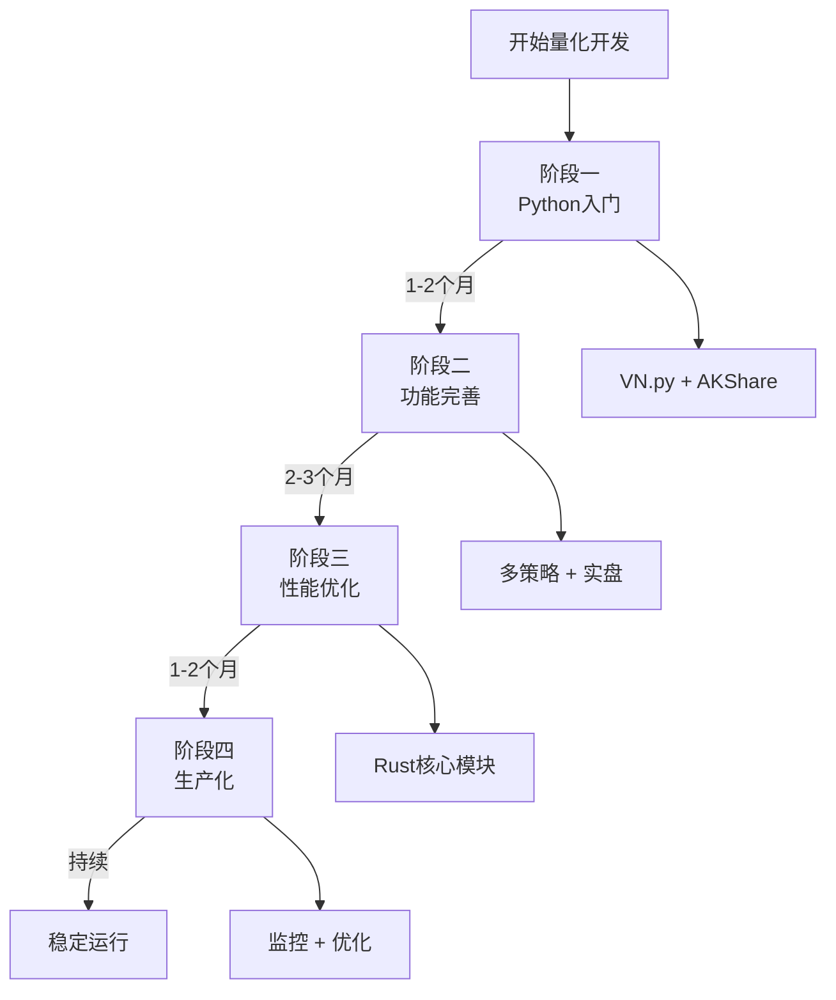

# A股量化交易系统

## 📋 基本信息

| 字段 | 内容 |
|------|------|
| **创建时间** | 2026-02-07 01:43 |
| **更新时间** | 2026-02-07 02:20 |
| **状态** | 🔄 规划中 |
| **进度** | 0% |

## 🎯 项目目标

构建高性能A股量化交易系统，支持：
- 历史数据回测（10年+）
- 分钟线级策略开发
- 实盘交易执行
- 实时风控监控

## 🛠️ 推荐技术栈

### 数据层

| 组件 | 功能 | 来源 |
|------|------|------|
| **AKShare** | A股数据获取 | GitHub (16,049★) |
| **TuShare** | 专业行情数据 | API |
| **PostgreSQL** | 历史数据存储 | 开源数据库 |
| **Redis** | 实时缓存 | 内存数据库 |

### 处理层

| 组件 | 功能 | 性能 |
|------|------|------|
| **Polars** | DataFrame处理 | 37,330★ |
| **Rust核心** | 高性能计算 | 50x Python |

### 策略层

| 框架 | 功能 | 成熟度 |
|------|------|--------|
| **VN.py** | 交易引擎 | 36,229★ ⭐⭐⭐⭐⭐ |
| **Backtrader** | 回测框架 | 20,351★ |

### 执行层

| 组件 | 功能 |
|------|------|
| **交易网关** | 券商API集成 |
| **风控系统** | 实时监控 |

## 📊 Python vs Rust 性能对比

| 场景 | Python/Pandas | Rust/Polars | 性能提升 |
|------|---------------|-------------|----------|
| **100万行数据处理** | ~5秒 | ~0.1秒 | 🚀 **50x** |
| **10年回测** | ~30秒 | ~1秒 | 🚀 **30x** |
| **实时行情处理** | ~100ms | ~5ms | 🚀 **20x** |
| **内存占用** | ~1GB | ~100MB | 💾 **10x** |

## 💰 成本分析

### 三种方案对比

| 方案 | 月成本 | 年度成本 | 回测速度 |
|------|--------|----------|----------|
| **入门方案** | ¥500 | ¥127,000 | 基础 |
| **标准方案** | ¥2,000 | ¥391,000 | 10x提升 |
| **高级方案** | ¥5,000 | ¥680,000 | 50x提升 |

### 成本构成

| 项目 | 标准方案 |
|------|----------|
| 服务器 | ¥2,000/月 |
| 数据源 | ¥200/月 |
| 开发人力 | 2-3人 |

## 📅 落地时间线

### 阶段一：基础搭建（1-2个月）

**时间**: 2026-02-01 ~ 2026-03-01

- [ ] 环境搭建（Docker + PostgreSQL + Redis）
- [ ] 数据采集模块（AKShare集成）
- [ ] 基础策略框架（VN.py入门）
- [ ] 回测系统搭建
- [ ] 基础风控模块

**里程碑**: 完成日线数据回测，实现简单均线策略

### 阶段二：功能完善（2-3个月）

**时间**: 2026-03-01 ~ 2026-06-01

- [ ] 券商API集成（选择1-2家券商）
- [ ] 分钟线回测支持
- [ ] 多策略支持
- [ ] 实时风控系统
- [ ] 交易信号通知

**里程碑**: 完成模拟交易测试，接入实盘交易（小额）

### 阶段三：性能优化（1-2个月）

**时间**: 2026-04-15 ~ 2026-07-01

- [ ] 性能瓶颈分析
- [ ] 关键路径Rust化
- [ ] 数据处理优化
- [ ] 延迟优化

**里程碑**: 回测速度提升10x，实盘延迟<100ms

### 阶段四：生产化（持续）

**时间**: 2026-06-01 ~ 2026-07-01+

- [ ] 监控告警系统
- [ ] 日志分析
- [ ] 灾备方案
- [ ] 策略迭代优化

## 🗺️ 技术栈演进路径

## 📋 立即行动清单（第一周）

- [ ] 安装AKShare: `pip install akshare`
- [ ] 安装VN.py: `pip install vnpy`
- [ ] 搭建Docker环境
- [ ] 实现简单均线策略
- [ ] 完成历史回测

## ⚠️ 关键成功因素

1. **数据质量**: 确保数据准确性和及时性
2. **风控意识**: 永远不要忽视风险控制
3. **持续学习**: 市场在变，策略也要迭代
4. **合规经营**: 遵守监管要求，避免违规操作

## 🏷️ 推荐框架选择矩阵

| 需求 | 推荐框架 | 备选 |
|------|----------|------|
| A股日线策略 | VN.py | Backtrader |
| 高频数据处理 | Polars | DataFusion |
| Rust开发 | Barter-rs | 自研 |
| Python-Rust混合 | PyO3 | Maturin |

## 🔗 相关链接

### 内部链接
- [[2026-02-07-Agent-Team-可视化报告/Agent-Team-可视化报告]]
- [[2026-02-07-对话总结与成果/2026-02-07-对话总结]]

### 外部资源
- [AKShare GitHub](https://github.com/akfamily/akshare)
- [VN.py GitHub](https://github.com/vnpy/vnpy)
- [Polars GitHub](https://github.com/pola-rs/polars)

---

> **记录时间**: 2026-02-07 02:26  
> **存储位置**: `/Volumes/jinpeng-1t/jinpeng-evolution/2026-02-07-A股量化交易系统`
