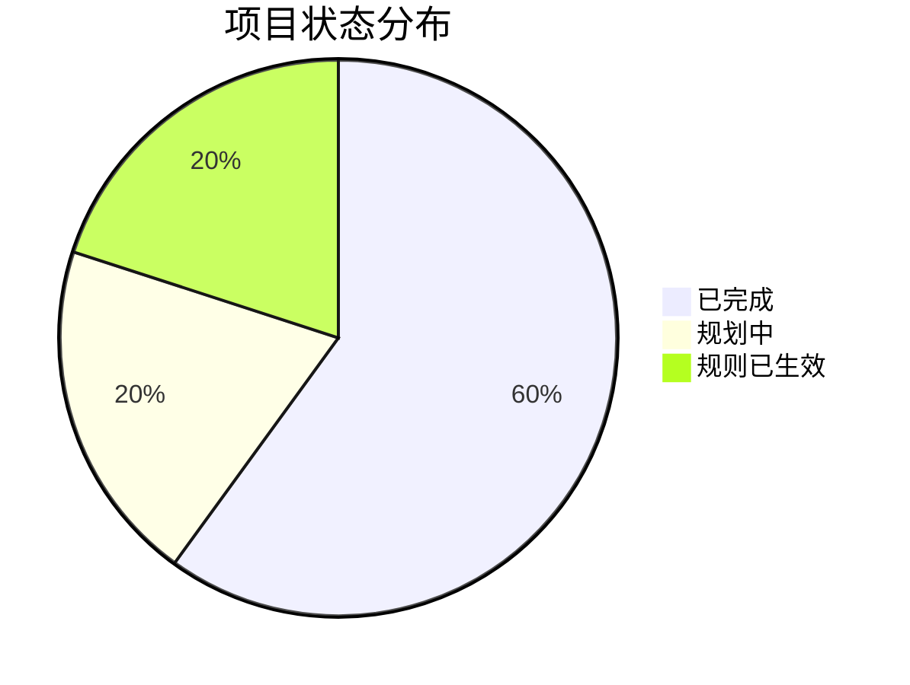

# 项目总索引

## 📊 统计概览

| 指标 | 数值 |
|------|------|
| **总项目数** | 4 |
| **已完成** | 2 |
| **进行中** | 0 |
| **规划中** | 1 |
| **规则文档** | 1 |

---

## 📅 按时间排序

### 2026年2月7日

| 时间 | 项目名称 | 类型 | 状态 | 进度 | 链接 |
|------|----------|------|------|------|------|
| 01:43 | Agent Team 可视化报告 | 项目 | ✅ 已完成 | 100% | [[2026-02-07-Agent-Team-可视化报告/Agent-Team-可视化报告]] |
| 01:43 | A股量化交易系统 | 项目 | 🔄 规划中 | 0% | [[2026-02-07-A股量化交易系统/A股量化交易系统]] |
| 02:21 | 任务/项目文档化规则 | 规则 | ✅ 已生效 | 100% | [[2026-02-07-文档化规则/任务项目文档化规则]] |
| 02:22 | 对话总结与成果 | 总结 | ✅ 已完成 | 100% | [[2026-02-07-对话总结与成果/2026-02-07-对话总结]] |

---

## 📂 按类型分类

### 🏢 项目 (2)

| 项目名称 | 状态 | 进度 | 最后更新 |
|----------|------|------|----------|
| [[2026-02-07-Agent-Team-可视化报告/Agent-Team-可视化报告]] | ✅ 已完成 | 100% | 2026-02-07 |
| [[2026-02-07-A股量化交易系统/A股量化交易系统]] | 🔄 规划中 | 0% | 2026-02-07 |

### 📜 规则 (1)

| 规则名称 | 状态 | 创建时间 |
|----------|------|----------|
| [[2026-02-07-文档化规则/任务项目文档化规则]] | ✅ 已生效 | 2026-02-07 |

### 📋 总结 (1)

| 总结名称 | 状态 | 创建时间 |
|----------|------|----------|
| [[2026-02-07-对话总结与成果/2026-02-07-对话总结]] | ✅ 已完成 | 2026-02-07 |

---

## 🏷️ 标签云

### 项目标签
- #Agent
- #量化交易
- #可视化报告
- #Python
- #Rust

### 状态标签
- #已完成
- #规划中
- #进行中
- #已生效

### 技术标签
- #VN.py
- #Polars
- #Obsidian
- #AKShare

### 规则标签
- #规则
- #文档化
- #自动化

---

## 📈 进度总览

### 项目进度分布

### 标签统计

| 标签 | 出现次数 |
|------|----------|
| #项目 | 2 |
| #规则 | 1 |
| #已完成 | 2 |
| #规划中 | 1 |
| #Agent | 1 |
| #量化交易 | 1 |
| #Python | 1 |
| #Rust | 1 |
| #Obsidian | 1 |

---

## 🔗 快速导航

### 最近更新

1. [[2026-02-07-Agent-Team-可视化报告/Agent-Team-可视化报告]] - 2026-02-07 02:20
2. [[2026-02-07-A股量化交易系统/A股量化交易系统]] - 2026-02-07 02:20
3. [[2026-02-07-文档化规则/任务项目文档化规则]] - 2026-02-07 02:21

### 热门项目

1. [[2026-02-07-A股量化交易系统/A股量化交易系统]] - 技术栈详细规划
2. [[2026-02-07-Agent-Team-可视化报告/Agent-Team-可视化报告]] - 对比分析报告

---

## 📝 今日摘要 (2026-02-07)

**今日新增项目**: 4个
- Agent Team 可视化报告（已完成）
- A股量化交易系统（规划中）
- 任务/项目文档化规则（已生效）
- 对话总结与成果（已完成）

**今日成果**: 
- 生成2个可视化报告文件
- 建立文档化规则体系
- 完成知识库基础架构
- 提取并整理历史对话中的所有任务、想法

**更新内容**:
- 从历史对话中提取4个项目/任务
- 创建独立的 Obsidian 文档
- 添加双向链接和标签
- 更新项目总索引

---

> **最后更新**: 2026-02-07 02:26  
> **存储位置**: `/Volumes/jinpeng-1t/jinpeng-evolution`  
> **索引文件**: 项目总索引.md
