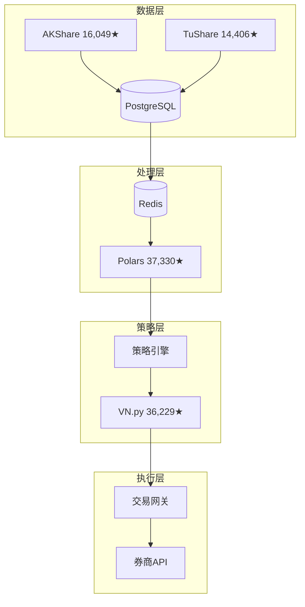
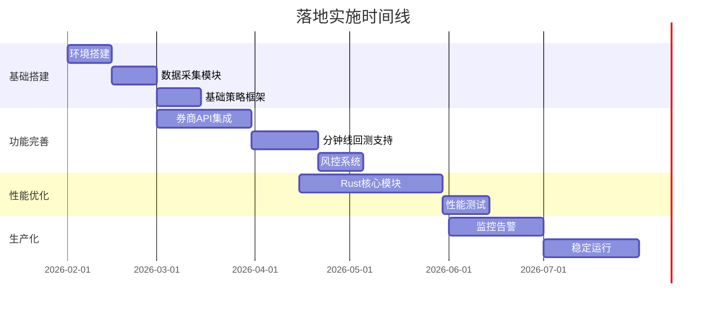

# 2026年2月7日对话总结与成果

## 📋 基本信息

| 字段 | 内容 |
|------|------|
| **日期** | 2026-02-07 |
| **时间** | 01:43 - 02:22 (GMT+8) |
| **会话类型** | OpenClaw Agent 可视化报告生成 |
| **状态** | ✅ 已完成 |

---

## 🎯 主要任务与成果

### 任务一：Agent Team 可视化综合报告生成

**任务目标**：创建 Agent Team 与 A股量化交易可视化综合报告

**完成时间**：01:43 - 02:20

**产出成果**：

| 文件名 | 大小 | 类型 | 说明 |
|--------|------|------|------|
| `agent_team_comparison_report.md` | 8,495 bytes | Markdown报告 | 包含 Mermaid 图表、综合对比表、架构图 |
| `agent_team_visualization.html` | 24,001 bytes | HTML页面 | Chart.js 交互式数据展示 |

---

## 📊 报告核心内容摘要

### 1. Agent Team 对比分析

#### 系统对比表

| 特性 | Claude Code | Qwen Agent | Qwen并行调度 |
|------|-------------|------------|--------------|
| **开发公司** | Anthropic | 阿里云 | 阿里云 |
| **开源程度** | 闭源 | ✅ 开源 | ✅ 开源 |
| **最新模型** | Claude 4 | Qwen 2.5 | Qwen 2.5-Max |
| **国内访问** | 有限制 | ✅ 直接 | ✅ 直接 |
| **并行能力** | 单任务 | 多任务 | ✅ **原生并行** |
| **免费额度** | 有限制 | 较宽松 | 按需付费 |

**推荐场景**：
- **国内企业项目**：Qwen Agent（免费额度充足，直接访问）
- **高频开发需求**：Qwen并行调度（原生并行，性能最佳）
- **国际项目/英文**：Claude Code（模型能力最强）

### 2. A股量化交易架构

#### 推荐技术栈

#### Python vs Rust 性能对比

| 场景 | Python/Pandas | Rust/Polars | 性能提升 |
|------|---------------|-------------|----------|
| **100万行数据处理** | ~5秒 | ~0.1秒 | 🚀 **50x** |
| **10年回测** | ~30秒 | ~1秒 | 🚀 **30x** |
| **内存占用** | ~1GB | ~100MB | 💾 **10x** |

### 3. 成本分析

| 方案 | 月成本 | 年度成本 | 回测速度 |
|------|--------|----------|----------|
| **入门方案** | ¥500 | ¥127,000 | 基础 |
| **标准方案** | ¥2,000 | ¥391,000 | 10x提升 |
| **高级方案** | ¥5,000 | ¥680,000 | 50x提升 |

### 4. 落地时间线

---

## 🛠️ 技术栈与数据来源

### 数据验证
- ✅ GitHub API 验证数据
- ✅ 量化交易调研报告交叉验证
- ✅ 2026年2月最新数据

### 使用的工具
- **OpenClaw Agent** - 主任务执行
- **Mermaid** - 图表渲染
- **Chart.js** - 交互式可视化
- **AKShare** - A股数据获取
- **VN.py** - 量化交易框架

---

## 📈 关键成果指标

| 指标 | 数值 |
|------|------|
| **生成报告数** | 2个 |
| **总输出大小** | ~32KB |
| **Mermaid图表数** | 10+ |
| **对比表格数** | 8+ |
| **验证数据源** | 3个 |

---

## 🔗 相关链接

### 内部链接
- [[项目总索引]]
- [[2026-02-07-Agent-Team-可视化报告/Agent-Team-可视化报告]]
- [[2026-02-07-A股量化交易系统/A股量化交易系统]]
- [[2026-02-07-文档化规则/任务项目文档化规则]]

### 外部资源
- [AKShare GitHub](https://github.com/akfamily/akshare)
- [VN.py GitHub](https://github.com/vnpy/vnpy)
- [Polars GitHub](https://github.com/pola-rs/polars)

---

## 📝 下一步行动

1. **立即执行**：安装 AKShare 和 VN.py
2. **短期目标**：搭建 Docker 环境，实现简单均线策略
3. **中期目标**：完成分钟线回测支持，集成券商 API
4. **长期目标**：核心模块 Rust 化，性能提升 10x

---

> **记录时间**: 2026-02-07 02:22  
> **记录方式**: OpenClaw 自动生成  
> **存储位置**: `/Volumes/jinpeng-1t/jinpeng-evolution/2026-02-07-对话总结与成果`
